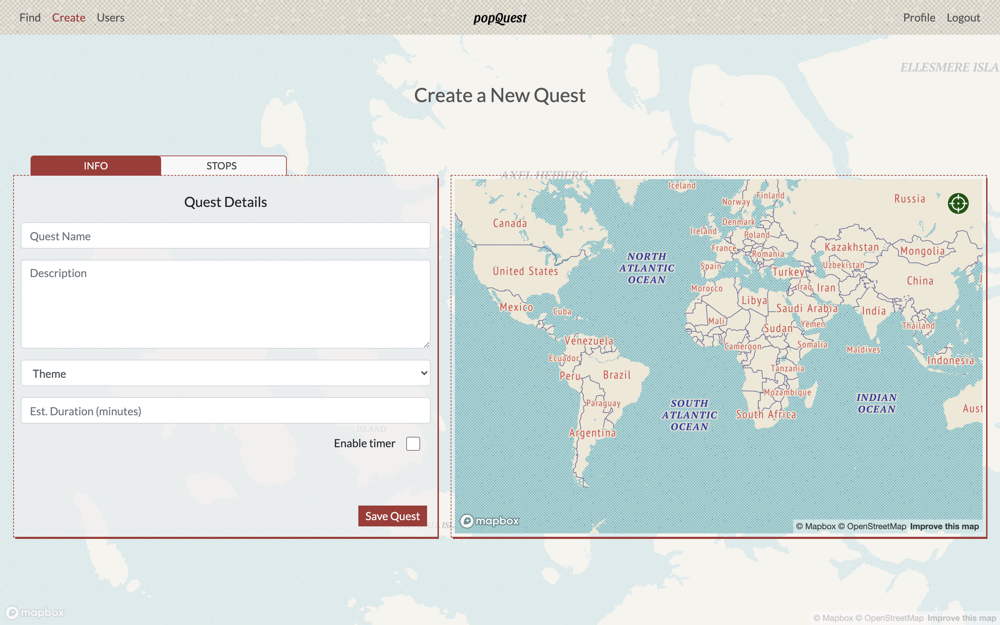

## Table of contents 

* Installation
* Project Overview 
* The Brief
* Technologies Used
* Approach
* Final Product - (screenshot walkthrough)
* Wins & Blockers
* Future Content and Improvements

 

## Installation

Clone or download the repo then do the following in Terminal:

- Install dependencies `npm i`
- Start the database `mongod --dbpath ~/data/db`
- Start the back-end server using nodemon `npm index.js`
- Change into front-end directory: `cd frontend`
- Install front-end dependencies: `npm i`
- Start front-end server: `npm run start`

 

## Overview 
PopQuest allows users to complete location quests within the city of their choosing. 
Each quest consists of a series of stops where the user must solve a clue in order to reveal the next stop. 
In some cases, the user device's coordinates will solve the clue based on its proximity to a given location. 
Quests can be timed for those seeking a challenge, or simply a 'guided tour'-like trip for those interested in a more leisurely journey.
Users can create their own quests which can be then accessed by any user. Users can also rate and review quests.

 

## Project Brief 
* Build a full-stack application by making your own backend and your own front-end
* Use a Python Django API using Django REST Framework to serve your data from a Postgres database
* Consume your API with a separate front-end built with React
* Be a complete product which most likely means multiple relationships and CRUD functionality for at least a couple of models
* Implement thoughtful user stories/wireframes that are significant enough to help you know which features are core MVP and which you can cut
* Be deployed online so it's publicly accessible.

 

## Technologies Used 

### Backend:
- Node
- Express
- Mongo DB
- Faker
- Bcrypt
- Mongoose
- pyJWT

### Frontend:
- React
- JavaScript
- Mapbox GL & Geocoder
- Axios
- Bootstrap
- SASS
- Cloudinary
- Http-proxy-middleware
- Nodemon
- React Router Dom

### Development tools:
- VS code
- NPM 
- Insomnia
- Git
- Github
- Google Chrome dev tools
- Heroku
- Trello Board
- Sketch
- Coolers
- Zoom
- Slack

 

## Approach 

Once our team decided on an idea, we worked together to map the basic wireframing and models. We discussed the user stories and separated what we viewed as the core needs from extra features. We landed on the below user stories as the foundation (MVP) for our app.

User Stories:

* User can participate in quests without Login/Account
* Logged in user can also create a profile
* Logged in user can rate & review completed quests
* Logged in user can create/delete quests, stops, clues/proximities
* Map is interactive, and responsive to user's location

Wireframe for Show All Quests Page:

 
 
Wireframe for Show Single Quest:

 
 

## Initial Steps

Having created the wireframes and user stories, we broke into 2 pairs, one pair focusing on the back-end, and the other pair on front-end.
This worked really well for us as we were able to make good progress straight away. We communicated throughout the day via Slack and Zooom calls.
We had stand-up every morning at 9.30 on Zoom, where we would discuss what we were working on, our plan for the day, and if there were any blockers and if any help needed with these.
We used a Trello board to create individual tasks which we would then update as we worked thorugh them.

The main task for me was to create the logic for the game, so that users can go through each stop and be asked a question,
and then once the last clue is answered correctly it would end the game and users can then choose a new quest. 
I also worked on styling the quest stops and on creating a timer for the game.

Here is a screenshot from part of the quest show page where the user will be at a certain stop along the quest, this also shows the form for the clue and answer:
 
 

 
 
The backend team setup the initial models, routes and controllers, here are some screenshots of the quests schema models, and of the seeds data created.
 
 

 
 

 
 

The quests index page needed to show a list of available quests on the right side and also a map of quests on left side.
The map was created to allow users to scroll and zoom to any location, which would also update the search results on the right hand side.

Screenshot of code for map zoom:
 

 
 
Screenshot of the front end for finding quests:
 

 

## Deployement

The app was finally deployed through Heroku, we linked upo and tested the frontend and backend so that the app would load simply from the backened only. 
Once this was fine, we deployed to Heroku and changed the database server from DBLabs to Atlas DB.

# Product Walkthrough 

## Home Page

This has a full screen view of a map of the world with the location randomly chosen, it scrolls very slowly to create a stunning visual appearance.
 

 
 

## Start A Quest 

 
 

## Create A Quest

 
 

## Find New Quest

 
 

## Profile Page

 
 

## Wins & Blockers 

We all worked remoteley so this was challenging in itself however with Zoom calls and Slack we were able to communicate very well. 
Initially we had a bit of a challenge getting used to working with Git/ Github as a team because it's a different approach than working solo.

We had several merge confilcts early on but with some excellent teamwork and guidance we were able to use best practices to resolve these. 
For me it was the first time I worked in a group where we are all pushing changes so I definitley learned a lot about using version control through these challeneges. 

I think the team worked really well, we communicated thorughout and helped each other each step so as to not make any major errors. 

Once we learned how to use Github this way the process became very smooth, and we all able to commit and pull changes whilst also working in seperate branches.

Another main challenge was getting Mapbox to work how we wanted. Sri took this task on which took a couple of days of going through documentation, support and testing various solutions. 

For me I had a challenge in styling for mobile view, I had built mainly for desktop so had to spend some time learning how to use Chrome Dev tools for mobile.

Another challenege was getting the timer to work properly, we wanted to time each quest from start to finish and then save the time to the user profile to create, 
a but more of a challenge for users.

Initially I tried using Reack hooks, however I felt that using class worked better for me for understanding the concept.

The biggest takeaways for me on this project were:

1. Learning a lot more about the basic concepts of React. This project gave me a much better understanding of how state, props and render work and how to use them.
I also became much more confident about how and when to use components.

2. Teamwork - It was an absolute pleasure working with such knowledgeable and helpful individuals. I really learned a lot from my team in how they approach problems.

3. Git / Github - No better way to learn than by diving in, making some mistakes and learning from them! I felt much more confident using Git after this.

## Future Content and Improvements

I think we are all quite happy generally, it works on mobile devices and has many of the features we wanted. 

We will probably refactor some of the code.

